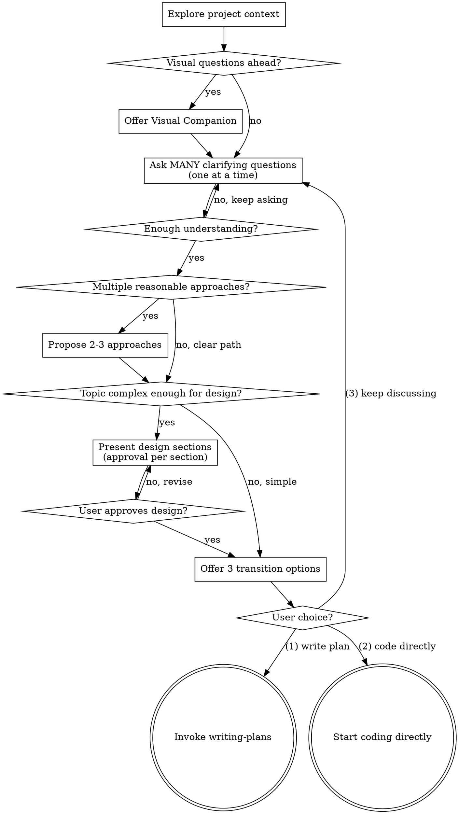

# quickbrain — Lightweight Brainstorming Into Designs

Help turn ideas into fully formed designs through natural collaborative dialogue. Ask many focused questions first, then transition directly into a detailed implementation plan — no intermediate spec file, no subagent review loops.

## Checklist

You MUST complete these in order:

1. **Explore project context** — check files, docs, recent commits
2. **Offer visual companion** (only if upcoming questions will benefit from visuals) — see the Visual Companion section
3. **Ask many clarifying questions** — one at a time. Keep asking. Do not stop early. Cover the user's intent, constraints, edge cases, and preferences in depth.
4. **Propose 2-3 approaches** — only if more than one reasonable approach exists. Skip this step when the path is clear.
5. **Present the design** — adaptive: skip for simple/clear topics, present in sections (with approval per section) for complex topics
6. **Offer transition options** — present three choices: (1) write the implementation plan, (2) start coding directly, or (3) continue discussing

## Process Flow

**Terminal states:** invoking `writing-plans.md` OR starting coding directly. Do not invoke any other skill.

## The Process

### Understanding the idea

- Check out the current project state first (files, docs, recent commits)
- Before asking detailed questions, assess scope: if the request describes multiple independent subsystems (e.g., "build a platform with chat, file storage, billing, and analytics"), flag this immediately. Don't spend questions refining details of a project that needs to be decomposed first.
- If the project is too large for a single plan, help the user decompose into sub-projects: what are the independent pieces, how do they relate, what order should they be built? Then brainstorm the first sub-project through the normal flow.

### Asking clarifying questions — the heart of this skill

This is where quickbrain spends most of its effort. Be thorough.

- **Ask MANY questions** — do not stop early. Keep refining until you genuinely understand the user's intent, not just the surface request.
- **One question per message** — never combine multiple questions
- **Prefer multiple-choice** — A/B/C/D options are easier to answer than open-ended ones, but open-ended is fine when needed
- **Follow the user's interest** — if a sub-topic seems important to them, ask more questions around it
- **Cover purpose, constraints, success criteria, edge cases, and preferences** — but don't enforce a checklist; let the conversation flow naturally
- **Don't rush to the design** — a few extra questions are cheap compared to building the wrong thing

### Exploring approaches (adaptive)

- If **more than one reasonable approach** exists, propose 2-3 with trade-offs and your recommendation
- If the **path is clear** (single obvious approach), skip this step
- When you do present approaches, lead with your recommendation and explain why

### Presenting the design (adaptive)

- For **simple/clear topics**, skip the design presentation entirely and go straight to transition options
- For **complex topics**, present the design in sections (architecture, components, data flow, error handling, testing). Scale each section to its complexity — a few sentences for straightforward parts, up to 200-300 words for nuanced parts. Ask after each section whether it looks right.

### Design for isolation and clarity

- Break the system into smaller units that each have one clear purpose, communicate through well-defined interfaces, and can be understood and tested independently
- For each unit, you should be able to answer: what does it do, how do you use it, and what does it depend on?
- Smaller, well-bounded units are also easier to work with — you reason better about code you can hold in context at once, and your edits are more reliable when files are focused.

### Working in existing codebases

- Explore the current structure before proposing changes. Follow existing patterns.
- Include targeted improvements only where they directly serve the current goal. Don't propose unrelated refactoring.

## Transition: After Brainstorming

Once the user is satisfied with the discussion (and the design, if you presented one), offer **three explicit options**:

> "I'm ready. How would you like to proceed?
>
> **(1) Write the implementation plan** — I'll create a detailed, step-by-step plan capturing everything we discussed
> **(2) Start coding directly** — I'll begin implementation now, no separate plan document
> **(3) Continue discussing** — there's more to refine
>
> Which one?"

**Wait for the user's explicit choice.** Do not pick for them.

### If the user chooses (1) Write the plan

Invoke the `writing-plans.md` skill in this directory. When you do, you MUST pass it a clear instruction:

> **Plan fidelity rule:** The plan must be **detailed** and **must capture every decision and detail discussed in this brainstorming session**. It must NOT add features, requirements, components, or considerations that were not discussed. If something seems missing from the discussion but might be needed, list it as an open question for the user rather than silently inventing it.

This rule exists because the original brainstorming workflow sometimes produced plans that were either incomplete or contained off-topic additions. quickbrain treats this as the most important property of the handoff.

### If the user chooses (2) Code directly

Proceed with implementation in this session. No separate plan document is written. Continue to honor the discussion: implement exactly what was discussed, no more and no less.

### If the user chooses (3) Keep discussing

Return to clarifying questions. Ask whatever else needs to be explored.

## Key Principles

- **One question at a time** — don't overwhelm
- **Ask many questions** — depth over speed; this fork exists because shallow understanding leads to wrong plans
- **Multiple choice preferred** — easier to answer than open-ended
- **YAGNI ruthlessly** — remove unnecessary features from all designs and plans
- **Explore alternatives only when they exist** — don't manufacture options for the sake of it
- **Adaptive depth** — simple topics get a light touch, complex topics get full treatment
- **Be flexible** — go back and clarify when something doesn't make sense
- **Fidelity to the conversation** — anything that goes downstream (plan, code) must reflect what was actually discussed, nothing else

## Visual Companion

A browser-based companion for showing mockups, diagrams, and visual options during brainstorming. It is a **tool**, not a mode — accepting it means it's available when useful, not that every question goes through the browser.

**Offering the companion:** When you anticipate that upcoming questions will involve visual content (mockups, layouts, diagrams), offer it once:

> "Some of what we're working on might be easier to explain if I can show it to you in a web browser. I can put together mockups, diagrams, comparisons, and other visuals as we go. This feature is still new and can be token-intensive. Want to try it? (Requires opening a local URL)"

You may include this offer in a normal message — there is no strict "must be its own message" rule in this fork. Just make sure the user notices it and can respond clearly.

**Per-question decision:** Even after the user accepts, decide for each question whether the browser or the terminal is the right channel:

- **Browser** for content that IS visual — mockups, wireframes, layout comparisons, architecture diagrams, side-by-side designs
- **Terminal** for content that is text — requirements questions, conceptual choices, tradeoff lists, A/B/C/D text options, scope decisions

A question about a UI topic is not automatically a visual question. "What does personality mean in this context?" is conceptual — use the terminal. "Which wizard layout works better?" is visual — use the browser.

If the user agrees to the companion, read `visual-companion.md` in this directory for the detailed usage guide.
